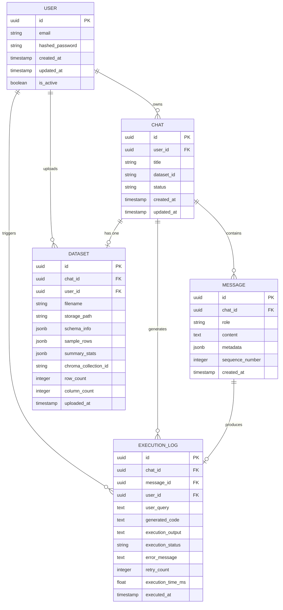

# Lumiq — Entity Relationship Diagram

## Entities and Relationships



---

## Attribute Descriptions

### USER
| Attribute | Type | Description |
|---|---|---|
| id | UUID (PK) | Supabase Auth user UUID — primary key, synced from auth.users |
| email | string | Unique email address for login |
| hashed_password | string | Managed by Supabase Auth (not stored in app layer) |
| created_at | timestamp | Account creation time |
| updated_at | timestamp | Last profile update time |
| is_active | boolean | Whether account is active (for soft-disable) |

> **Note:** Supabase Auth manages the `auth.users` table. A mirrored `public.users` table stores
> app-level user metadata. The `id` in `public.users` is a FK to `auth.users.id`.

### CHAT
| Attribute | Type | Description |
|---|---|---|
| id | UUID (PK) | Unique chat identifier |
| user_id | UUID (FK → USER.id) | Owner of the chat |
| title | string | Auto-generated from first query; user can rename |
| dataset_id | UUID (FK → DATASET.id) | The single dataset linked to this chat |
| status | string | `active` \| `archived` — for soft-delete/hide |
| created_at | timestamp | When chat was created |
| updated_at | timestamp | When last message was sent |

### MESSAGE
| Attribute | Type | Description |
|---|---|---|
| id | UUID (PK) | Unique message identifier |
| chat_id | UUID (FK → CHAT.id) | Parent chat |
| role | string | `user` or `assistant` — strict enum |
| content | text | Raw message content (plain text for user; JSON string for assistant) |
| metadata | jsonb | For assistant messages: `{code, result, reasoning, assumptions, processing_phases}` |
| sequence_number | integer | Order within the chat (1-indexed, monotonically increasing) |
| created_at | timestamp | Message timestamp |

> **Assistant message `metadata` structure:**
> ```json
> {
>   "answer": "string",
>   "code": "string",
>   "result": "any",
>   "result_type": "dataframe | scalar | list | error",
>   "reasoning": "string",
>   "assumptions": ["string"],
>   "rag_context_used": ["string"],
>   "retry_count": 0
> }
> ```

### DATASET
| Attribute | Type | Description |
|---|---|---|
| id | UUID (PK) | Unique dataset identifier |
| chat_id | UUID (FK → CHAT.id) | Chat this dataset belongs to (1:1) |
| user_id | UUID (FK → USER.id) | Owner of the dataset |
| filename | string | Original uploaded filename |
| storage_path | string | Server filesystem path where CSV is stored (e.g., `/data/uploads/{user_id}/{dataset_id}.csv`) |
| schema_info | jsonb | `{columns: [{name, dtype, nullable}]}` |
| sample_rows | jsonb | First 5 rows as array of objects |
| summary_stats | jsonb | Output of `df.describe().to_dict()` |
| chroma_collection_id | string | ChromaDB collection name for this dataset's embeddings |
| row_count | integer | Total number of rows |
| column_count | integer | Total number of columns |
| uploaded_at | timestamp | Upload timestamp |

> **`schema_info` structure:**
> ```json
> {
>   "columns": [
>     {"name": "revenue", "dtype": "float64", "nullable": false, "unique_count": 340},
>     {"name": "region",  "dtype": "object",  "nullable": false, "unique_values": ["North","South"]}
>   ]
> }
> ```

### EXECUTION_LOG
| Attribute | Type | Description |
|---|---|---|
| id | UUID (PK) | Unique log entry identifier |
| chat_id | UUID (FK → CHAT.id) | Chat in which execution occurred |
| message_id | UUID (FK → MESSAGE.id) | The assistant message that produced this execution |
| user_id | UUID (FK → USER.id) | User who triggered the execution |
| user_query | text | The exact user query that triggered this execution |
| generated_code | text | The exact Pandas code generated and executed |
| execution_output | text | Serialized execution result (string representation) |
| execution_status | string | `success` \| `error` \| `timeout` \| `rejected` |
| error_message | text | Python traceback or error string if execution failed |
| retry_count | integer | Number of retries (0 = first attempt succeeded) |
| execution_time_ms | float | Wall-clock execution time in milliseconds |
| executed_at | timestamp | When execution occurred |

---

## Key Relationships Summary

| Relationship | Cardinality | Description |
|---|---|---|
| USER → CHAT | One-to-Many | A user owns many chats; a chat belongs to one user |
| USER → DATASET | One-to-Many | A user uploads many datasets (one per chat) |
| CHAT → MESSAGE | One-to-Many | A chat contains many messages in sequence |
| CHAT → DATASET | One-to-One | Each chat has exactly one dataset uploaded to it |
| CHAT → EXECUTION_LOG | One-to-Many | Many executions can happen in one chat |
| MESSAGE → EXECUTION_LOG | One-to-One | Each assistant message has at most one execution log entry |

---

## Supabase Row Level Security (RLS) Policies

Apply these policies to enforce user-level data isolation:

```sql
-- CHAT table: users can only access their own chats
CREATE POLICY "user_chats" ON chat
  FOR ALL USING (auth.uid() = user_id);

-- MESSAGE table: accessible only through owned chats
CREATE POLICY "user_messages" ON message
  FOR ALL USING (
    chat_id IN (SELECT id FROM chat WHERE user_id = auth.uid())
  );

-- DATASET table: users can only access their own datasets
CREATE POLICY "user_datasets" ON dataset
  FOR ALL USING (auth.uid() = user_id);

-- EXECUTION_LOG table: users can only access their own logs
CREATE POLICY "user_logs" ON execution_log
  FOR ALL USING (auth.uid() = user_id);
```

---

## Indexes (Performance)

```sql
CREATE INDEX idx_chat_user_id ON chat(user_id);
CREATE INDEX idx_chat_updated_at ON chat(updated_at DESC);
CREATE INDEX idx_message_chat_id ON message(chat_id);
CREATE INDEX idx_message_sequence ON message(chat_id, sequence_number);
CREATE INDEX idx_dataset_chat_id ON dataset(chat_id);
CREATE INDEX idx_execution_log_chat_id ON execution_log(chat_id);
CREATE INDEX idx_execution_log_user_id ON execution_log(user_id);
```
