# Lumiq — Class Diagram

## Backend Service Classes

```mermaid
classDiagram

    class DatasetManager {
        -supabase: SupabaseClient
        -upload_dir: str
        +load_csv(file_path: str) DataFrame
        +extract_schema(df: DataFrame) dict
        +extract_sample_rows(df: DataFrame, n: int) list[dict]
        +extract_summary_stats(df: DataFrame) dict
        +save_dataset_metadata(chat_id: str, user_id: str, filename: str, schema: dict, samples: list, stats: dict) Dataset
        +get_dataset_by_chat_id(chat_id: str) Dataset
        +load_dataframe_from_storage(storage_path: str) DataFrame
        +validate_csv(file_path: str) tuple[bool, str]
    }

    class ChatManager {
        -supabase: SupabaseClient
        +create_chat(user_id: str, title: str) Chat
        +get_chats_by_user(user_id: str) list[Chat]
        +get_chat_by_id(chat_id: str, user_id: str) Chat
        +update_chat_title(chat_id: str, title: str) Chat
        +archive_chat(chat_id: str) void
        +add_message(chat_id: str, role: str, content: str, metadata: dict) Message
        +get_messages_by_chat(chat_id: str) list[Message]
        +get_recent_context(chat_id: str, n: int) list[Message]
        +auto_generate_title(first_query: str) str
    }

    class RAGService {
        -chroma_client: chromadb.Client
        -embedding_fn: HuggingFaceEmbeddingFunction
        -collections: dict[str, Collection]
        +create_collection(collection_id: str) Collection
        +get_or_create_collection(collection_id: str) Collection
        +index_dataset(collection_id: str, schema: dict, samples: list, stats: dict) void
        +build_documents(schema: dict, samples: list, stats: dict) list[str]
        +retrieve_context(collection_id: str, query: str, n_results: int) list[str]
        +delete_collection(collection_id: str) void
        -_format_schema_document(schema: dict) str
        -_format_sample_document(samples: list) str
        -_format_stats_document(stats: dict) str
    }

    class CodeGenerator {
        -llm_client: LLMClient
        -system_prompt: str
        +generate_code(query: str, schema_context: list[str], chat_history: list[dict], dataset_schema: dict) CodeGenerationResult
        +build_prompt(query: str, schema_context: list[str], history: list[dict], schema: dict) str
        +extract_code_from_response(llm_response: str) str
        +validate_code_safety(code: str) tuple[bool, str]
        -_build_system_prompt() str
        -_format_history_for_prompt(history: list[dict]) str
    }

    class ExecutionEngine {
        -allowed_imports: set[str]
        -timeout_seconds: int
        +execute(code: str, df: DataFrame) ExecutionResult
        +build_safe_globals() dict
        +serialize_result(result: any) tuple[str, str]
        -_run_with_timeout(code: str, scope: dict) any
        -_check_forbidden_patterns(code: str) tuple[bool, str]
    }

    class Evaluator {
        -llm_client: LLMClient
        -max_retries: int
        +evaluate(query: str, code: str, result: ExecutionResult) EvaluationResult
        +should_retry(eval_result: EvaluationResult) bool
        +generate_retry_prompt(query: str, code: str, error: str, attempt: int) str
        -_check_result_non_null(result: ExecutionResult) bool
        -_check_result_type_valid(result: ExecutionResult) bool
        -_llm_evaluate_relevance(query: str, result: str) bool
    }

    class ExplanationService {
        +format_response(query: str, code: str, result: ExecutionResult, eval_result: EvaluationResult, rag_context: list[str]) AssistantResponse
        +format_dataframe_result(df: DataFrame) dict
        +generate_reasoning(query: str, code: str, result: any, schema_context: list[str]) str
        +extract_assumptions(code: str, schema: dict) list[str]
        +format_error_response(query: str, error: str, retry_count: int) AssistantResponse
        +format_rejection_response(query: str, reason: str) AssistantResponse
    }

    class LLMClient {
        -api_key: str
        -model: str
        -base_url: str
        -http_client: httpx.AsyncClient
        +complete(messages: list[dict], temperature: float, max_tokens: int) str
        +complete_with_retry(messages: list[dict], max_attempts: int) str
        -_build_headers() dict
    }

    class ExecutionLogService {
        -supabase: SupabaseClient
        +log_execution(chat_id: str, message_id: str, user_id: str, query: str, code: str, output: str, status: str, error: str, retry_count: int, exec_time: float) void
        +get_logs_by_chat(chat_id: str) list[ExecutionLog]
    }

    DatasetManager --> RAGService : "triggers indexing on upload"
    CodeGenerator --> RAGService : "retrieves schema context"
    CodeGenerator --> LLMClient : "uses for generation"
    Evaluator --> LLMClient : "uses for evaluation"
    Evaluator --> ExecutionEngine : "inspects result"
    ExplanationService --> Evaluator : "uses eval result"
```



---

## Data Transfer Objects (Pydantic Models)

```mermaid
classDiagram

    class CodeGenerationResult {
        +code: str
        +raw_llm_response: str
        +prompt_tokens: int
    }

    class ExecutionResult {
        +success: bool
        +output: any
        +output_type: str
        +error: str | None
        +execution_time_ms: float
        +serialized_output: str
    }

    class EvaluationResult {
        +is_valid: bool
        +is_relevant: bool
        +confidence: float
        +reason: str
        +should_retry: bool
        +suggested_fix: str | None
    }

    class AssistantResponse {
        +answer: str
        +code: str
        +result: any
        +result_type: str
        +reasoning: str
        +assumptions: list[str]
        +rag_context_used: list[str]
        +retry_count: int
        +processing_phases: list[str]
    }

    class UploadRequest {
        +chat_id: str
        +file: UploadFile
    }

    class ChatRequest {
        +chat_id: str
        +query: str
        +user_id: str
    }

    class ChatResponse {
        +message_id: str
        +response: AssistantResponse
        +chat_id: str
        +created_at: str
    }

    class Dataset {
        +id: str
        +chat_id: str
        +user_id: str
        +filename: str
        +storage_path: str
        +schema_info: dict
        +sample_rows: list
        +summary_stats: dict
        +chroma_collection_id: str
        +row_count: int
        +column_count: int
        +uploaded_at: str
    }

    class Chat {
        +id: str
        +user_id: str
        +title: str
        +dataset_id: str | None
        +status: str
        +created_at: str
        +updated_at: str
    }

    class Message {
        +id: str
        +chat_id: str
        +role: str
        +content: str
        +metadata: dict | None
        +sequence_number: int
        +created_at: str
    }
```



---

## Full Pipeline Orchestrator

The `ChatOrchestrator` coordinates all services in the correct order for a single query request.
It lives in `backend/services/orchestrator.py`.

```python
class ChatOrchestrator:
    """
    Coordinates the full query pipeline:
    user query → RAG → codegen → execution → evaluation → explanation → persist
    """
    def __init__(
        self,
        dataset_manager: DatasetManager,
        chat_manager: ChatManager,
        rag_service: RAGService,
        code_generator: CodeGenerator,
        execution_engine: ExecutionEngine,
        evaluator: Evaluator,
        explanation_service: ExplanationService,
        log_service: ExecutionLogService,
    ): ...

    async def handle_query(
        self,
        chat_id: str,
        user_id: str,
        query: str,
    ) -> ChatResponse:
        """
        Full pipeline execution. Steps:
        1. Load dataset metadata + DataFrame
        2. Retrieve RAG context from ChromaDB
        3. Load recent chat history (last 10 messages)
        4. Generate Pandas code via LLM
        5. Validate code safety
        6. Execute code in controlled scope
        7. Evaluate result (up to 2 retries)
        8. Format explanation
        9. Persist assistant message + execution log
        10. Return ChatResponse
        """
```

---

## Module Responsibilities Summary

| Module | File | Responsibility |
|---|---|---|
| `DatasetManager` | `services/dataset_manager.py` | CSV ingestion, schema extraction, metadata persistence, DataFrame loading |
| `ChatManager` | `services/chat_manager.py` | Chat CRUD, message persistence, history retrieval |
| `RAGService` | `services/rag_service.py` | ChromaDB operations, embedding, retrieval |
| `CodeGenerator` | `services/code_generator.py` | LLM prompt construction, code generation, code extraction from response |
| `ExecutionEngine` | `services/execution_engine.py` | Safe `exec()` runtime, restricted globals, timeout enforcement |
| `Evaluator` | `services/evaluator.py` | Result validation, retry decision, relevance check |
| `ExplanationService` | `services/explanation.py` | Response formatting, reasoning generation, assumption extraction |
| `LLMClient` | `services/llm_client.py` | Async LLM API wrapper (Groq or Gemini) |
| `ExecutionLogService` | `services/log_service.py` | Execution audit logging to Supabase |
| `ChatOrchestrator` | `services/orchestrator.py` | Coordinates full pipeline, single entry point for query handling |

---

## Service Initialization (Dependency Injection)

All services are initialized once at application startup in `backend/main.py` using FastAPI's
dependency injection system:

```python
# backend/main.py

@asynccontextmanager
async def lifespan(app: FastAPI):
    # Initialize all services once, share via app.state
    app.state.llm_client = LLMClient(api_key=settings.LLM_API_KEY, model=settings.LLM_MODEL)
    app.state.rag_service = RAGService(persist_dir=settings.CHROMA_PERSIST_DIR)
    app.state.dataset_manager = DatasetManager(supabase=supabase, upload_dir=settings.UPLOAD_DIR)
    app.state.chat_manager = ChatManager(supabase=supabase)
    app.state.code_generator = CodeGenerator(llm_client=app.state.llm_client)
    app.state.execution_engine = ExecutionEngine()
    app.state.evaluator = Evaluator(llm_client=app.state.llm_client)
    app.state.explanation_service = ExplanationService()
    app.state.log_service = ExecutionLogService(supabase=supabase)
    app.state.orchestrator = ChatOrchestrator(...)
    yield
    # Cleanup on shutdown
```
