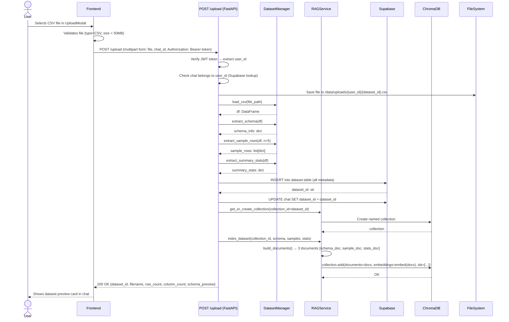
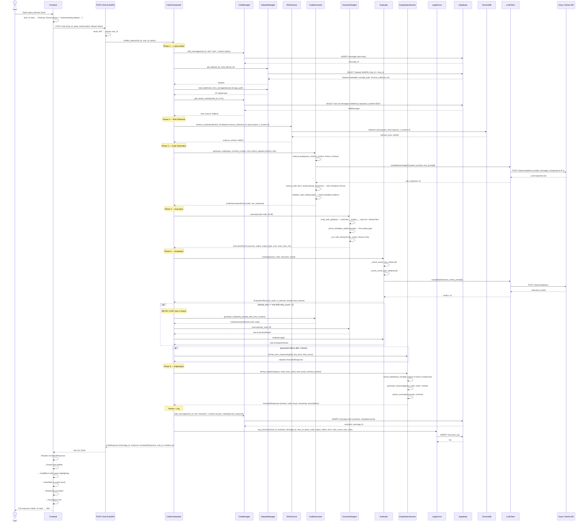
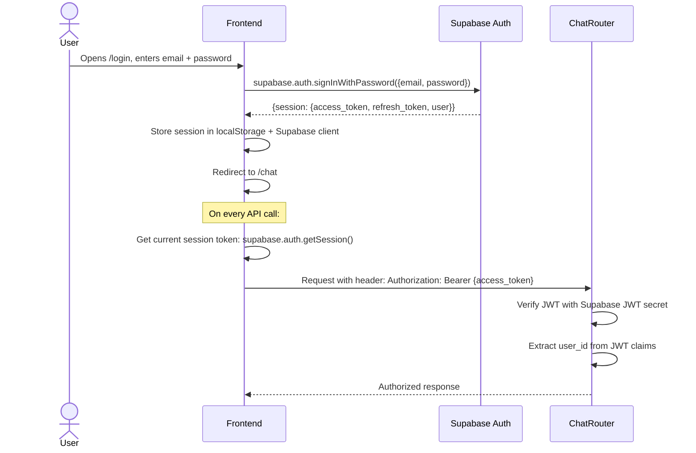
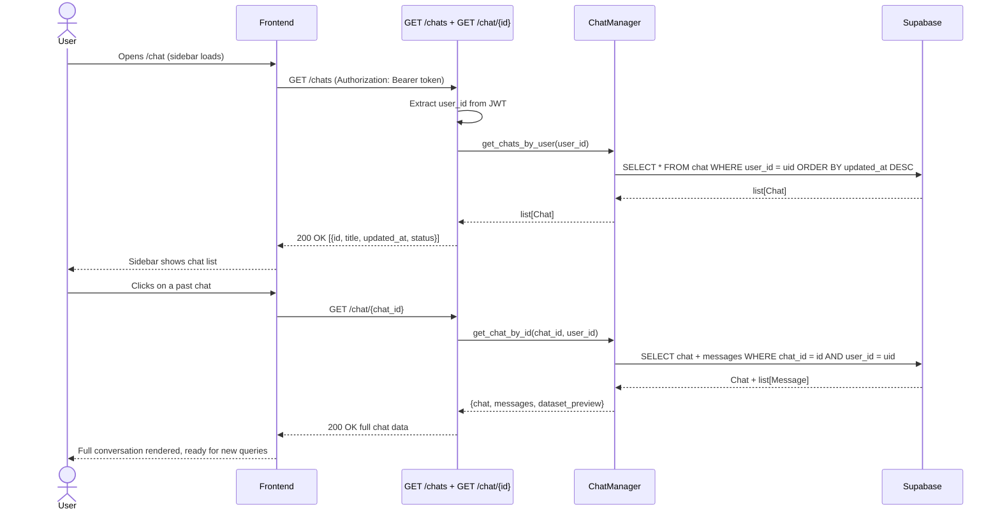
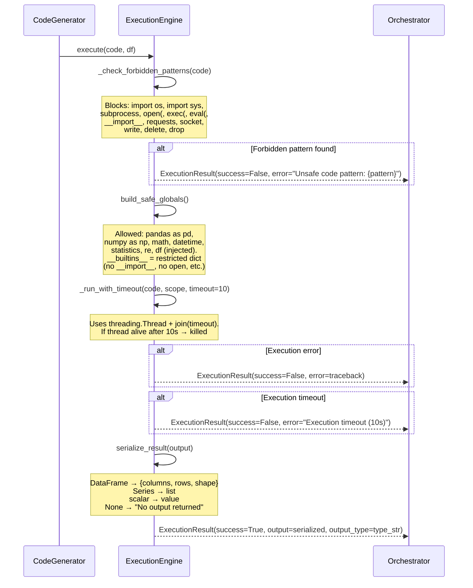

# Lumiq — Sequence Diagrams

## 1. Dataset Upload Lifecycle

---

## 2. Query Handling Lifecycle (Core Pipeline)

---

## 3. Authentication Flow

---

## 4. Load Past Chat Flow

---

## 5. Code Safety Validation Flow (ExecutionEngine detail)

