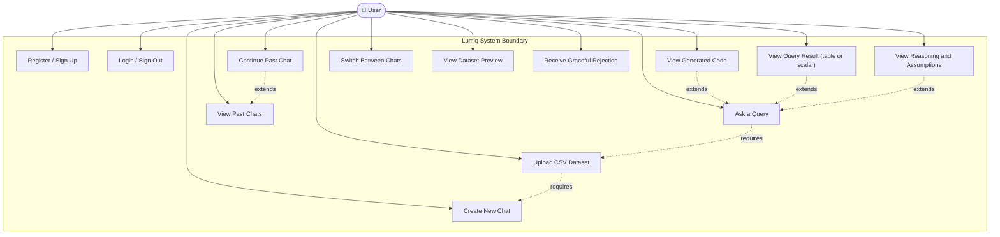

# Lumiq — Use Case Diagram

## Actors and Use Cases

---

## Detailed Use Case Specifications

---

### UC1: Register / Sign Up

| Field | Detail |
|---|---|
| **Actor** | Unauthenticated User |
| **Preconditions** | User is not logged in; email not already registered |
| **Trigger** | User navigates to `/signup` and submits the form |
| **Main Flow** | 1. User enters email + password on `/signup` page 2. Frontend calls `supabase.auth.signUp({email, password})` 3. Supabase creates user in `auth.users` 4. System inserts matching row in `public.users` (via Supabase trigger) 5. User is redirected to `/chat` (auto-logged in) |
| **Alternate Flow** | Email already registered → Supabase returns error → Frontend shows "Email already in use" |
| **Postconditions** | User is authenticated; session token stored in browser |
| **Notes** | Password minimum 8 characters enforced by Supabase; no email verification required in MVP |

---

### UC2: Login / Sign Out

| Field | Detail |
|---|---|
| **Actor** | Registered User |
| **Preconditions** | User has an existing account |
| **Trigger** | User navigates to `/login` and submits credentials |
| **Main Flow** | 1. User enters email + password on `/login` 2. Frontend calls `supabase.auth.signInWithPassword({email, password})` 3. Supabase returns `{session: {access_token, refresh_token, user}}` 4. Session stored by Supabase JS client (localStorage) 5. User redirected to `/chat` |
| **Sign Out Flow** | 1. User clicks "Sign Out" in sidebar 2. Frontend calls `supabase.auth.signOut()` 3. Session cleared 4. Redirect to `/login` |
| **Alternate Flow** | Invalid credentials → error "Invalid email or password" |
| **Postconditions** | User has valid JWT for all subsequent API calls |

---

### UC3: Create New Chat

| Field | Detail |
|---|---|
| **Actor** | Authenticated User |
| **Preconditions** | User is logged in and on `/chat` |
| **Trigger** | User clicks "+ New Chat" button in sidebar |
| **Main Flow** | 1. Frontend calls `POST /chats` with `{title: "New Chat"}` 2. Backend creates chat record in Supabase with `status=active, dataset_id=null` 3. Returns `{chat_id, title, created_at}` 4. Frontend navigates to `/chat/{chat_id}` 5. Chat panel shows "Upload a CSV to begin" placeholder |
| **Postconditions** | New chat exists in DB; sidebar updated; user sees empty chat panel |
| **Notes** | Chat title is "New Chat" until first query is sent, then auto-renamed |

---

### UC4: Upload CSV Dataset

| Field | Detail |
|---|---|
| **Actor** | Authenticated User |
| **Preconditions** | User is in a chat session with no dataset yet uploaded |
| **Trigger** | User clicks "Upload CSV" button or drags file into chat panel |
| **Main Flow** | 1. UploadModal opens; user selects a `.csv` file 2. Frontend validates: file extension must be `.csv`; size ≤ 50MB 3. Frontend calls `POST /upload` with `multipart/form-data: {file, chat_id}` 4. Backend saves file to disk at `/data/uploads/{user_id}/{dataset_id}.csv` 5. DatasetManager loads CSV into DataFrame, extracts schema + samples + stats 6. Dataset metadata stored in Supabase `dataset` table 7. RAGService creates ChromaDB collection and indexes 3 documents 8. Chat `dataset_id` updated in Supabase 9. Response returns dataset preview (columns, row count, sample) |
| **Alternate Flows** | File not a CSV → Frontend rejects before upload File has no headers → Backend returns 400 "CSV must have column headers" File > 50MB → Frontend rejects "File too large (max 50MB)" CSV parse error → Backend returns 422 with error detail |
| **Postconditions** | Dataset persisted; ChromaDB collection ready; chat shows dataset preview card |
| **UI State** | Upload button replaced by dataset info card; "Ask a question…" input becomes active |
| **Notes** | Only one dataset per chat. Re-uploading to same chat is not supported in MVP. |

---

### UC5: Ask a Query

| Field | Detail |
|---|---|
| **Actor** | Authenticated User |
| **Preconditions** | User is in a chat with an uploaded dataset |
| **Trigger** | User types a natural language question and presses Enter or Send |
| **Main Flow** | 1. Frontend adds user message to chat panel immediately (optimistic UI) 2. Frontend sets state to "thinking" → animated phase indicator starts 3. `POST /chat {chat_id, query}` sent with Bearer token 4. Backend runs full orchestration pipeline (see sequence diagram SC2) 5. Phases show in UI as backend progresses: &nbsp;&nbsp;&nbsp;→ "Understanding dataset…" &nbsp;&nbsp;&nbsp;→ "Retrieving context…" &nbsp;&nbsp;&nbsp;→ "Generating analysis…" &nbsp;&nbsp;&nbsp;→ "Executing code…" &nbsp;&nbsp;&nbsp;→ "Evaluating result…" &nbsp;&nbsp;&nbsp;→ "Preparing response…" 6. Response JSON returned with full AssistantResponse 7. Frontend renders full structured response |
| **Alternate Flows** | No dataset uploaded → Frontend shows "Please upload a CSV before asking questions" Query rejected by evaluator after retries → UC13 (graceful rejection) LLM API timeout → 504 response → Frontend shows "Analysis timed out. Please try again." |
| **Postconditions** | User message + assistant message both persisted in DB; execution log created |
| **Input Constraint** | Query must be non-empty; max 1000 characters |
| **Query Examples** | "What is the average revenue by region?", "Show top 5 customers by order count", "Which month had the highest sales?" |

---

### UC6: View Generated Code

| Field | Detail |
|---|---|
| **Actor** | Authenticated User |
| **Preconditions** | An assistant response has been received |
| **Trigger** | Response is rendered; code block is always visible in response |
| **Main Flow** | 1. Assistant response includes a `code` field 2. Frontend renders code in `<CodeBlock>` component using `react-syntax-highlighter` 3. Language is always `python`; theme is `vscDarkPlus` 4. Copy-to-clipboard button visible on hover |
| **Postconditions** | User can read and copy the exact Pandas code that produced the result |
| **Notes** | Code block is ALWAYS shown — this is a transparency requirement, never optional |

---

### UC7: View Query Result (Table or Scalar)

| Field | Detail |
|---|---|
| **Actor** | Authenticated User |
| **Preconditions** | Assistant response received with `result` field |
| **Main Flow** | 1. If `result_type == "dataframe"`: render `<DataTable>` component with paginated rows (max 50 rows shown, "Show more" for larger) 2. If `result_type == "scalar"`: render highlighted numeric/string value in a callout box 3. If `result_type == "list"`: render as ordered list 4. If `result_type == "error"`: render error state card |
| **Postconditions** | User sees the actual execution output clearly |
| **Notes** | DataTable supports horizontal scroll for wide DataFrames |

---

### UC8: View Reasoning and Assumptions

| Field | Detail |
|---|---|
| **Actor** | Authenticated User |
| **Preconditions** | Assistant response received |
| **Main Flow** | 1. Below the code block, an expandable "Reasoning" section shows step-by-step explanation 2. Below that, "Assumptions" shows a bulleted list of any assumptions made |
| **Notes** | Reasoning and Assumptions are always included in response. Expanded by default on first render. |

---

### UC9: View Past Chats

| Field | Detail |
|---|---|
| **Actor** | Authenticated User |
| **Preconditions** | User is logged in; at least one chat exists |
| **Trigger** | User opens `/chat` (sidebar always loads chat list) |
| **Main Flow** | 1. Sidebar calls `GET /chats` on mount 2. Returns list of chats ordered by `updated_at DESC` 3. Each item shows: chat title, relative timestamp ("2 hours ago"), dataset filename if present 4. Active chat is highlighted in sidebar |
| **Postconditions** | User sees all their chats in recency order |

---

### UC10: Continue Past Chat

| Field | Detail |
|---|---|
| **Actor** | Authenticated User |
| **Preconditions** | User has at least one past chat with a dataset and messages |
| **Trigger** | User clicks a past chat in the sidebar |
| **Main Flow** | 1. Frontend calls `GET /chat/{chat_id}` 2. Backend returns full chat: metadata + all messages + dataset info 3. Frontend renders full conversation history 4. Dataset is still available on server; ChromaDB collection still exists 5. User types a new query → UC5 |
| **Alternate Flow** | If dataset file was deleted from server → Backend returns 404 for query → Show "Dataset no longer available. Please create a new chat." |
| **Postconditions** | User is back in the chat with full context; can continue querying |
| **Notes** | Full message history included in LLM context for continuity (last 10 messages) |

---

### UC11: Switch Between Chats

| Field | Detail |
|---|---|
| **Actor** | Authenticated User |
| **Preconditions** | User has multiple chats |
| **Trigger** | User clicks a different chat in sidebar while viewing current chat |
| **Main Flow** | 1. Frontend navigates to `/chat/{new_chat_id}` 2. New chat loads via `GET /chat/{id}` 3. Context switches completely — no data from previous chat shown 4. Sidebar highlights new active chat |
| **Postconditions** | Correct chat isolated; no context leakage between chats |

---

### UC12: View Dataset Preview

| Field | Detail |
|---|---|
| **Actor** | Authenticated User |
| **Preconditions** | Dataset uploaded to current chat |
| **Trigger** | Automatic on upload; visible in chat as a pinned card |
| **Main Flow** | 1. After upload, a dataset preview card is pinned at top of chat 2. Card shows: filename, row count, column count, list of column names + dtypes, first 3 rows |
| **Postconditions** | User understands their dataset structure before querying |

---

### UC13: Receive Graceful Rejection

| Field | Detail |
|---|---|
| **Actor** | Authenticated User |
| **Preconditions** | User asked a query that the system cannot reliably answer |
| **Trigger** | Evaluator rejects after max retries, or CodeGenerator detects unsupported query |
| **Main Flow** | 1. System responds with a structured rejection card 2. Card contains: "I was unable to reliably answer this query" + reason + suggestions for rephrasing |
| **Rejection Reasons** | Ambiguous column reference; query asks for data not in the dataset; code execution timeout; result not relevant to query |
| **Postconditions** | User is informed clearly without a fabricated answer; can retry with a clearer query |
| **Notes** | Rejection is ALWAYS preferred over returning a hallucinated/incorrect answer |
